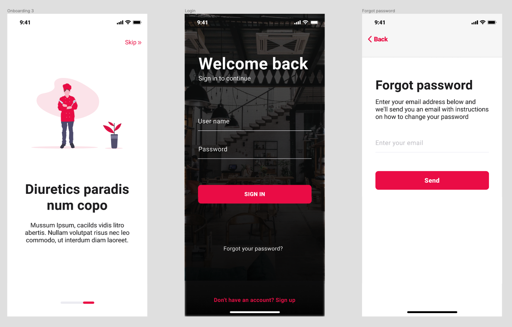

<h3 align="center">
  Desafio 6: Criar um app mobile que irá consumir a API construída no Projeto-03.
</h3>

<blockquote align="center">
"A maior barreira para o sucesso é o medo do fracasso.." 
  
Sven Goran Eriksson

</blockquote>

  
  

  

  

## :computer:Sobre o desafio

### Requisitos:
- App mobile (nativo ou híbrido)
- Utilizar o recurso da câmera do celular para escaner um QR Code;
- Código limpo e comentado sāo requisitos do desafio.

### Conhecimento em:

Qualquer linguagem ou framework para app mobile.

## :pencil2: Telas e Layout

  

- Splash screen;
- Onboarding;
- Create Account
- Login;
- Forgot password;
- Profile;
- Home;
- QR Code;
- Trending;
- Item Details;
- Order;
- Checkout;
- Confirmation.

Clique para ver o <a href="https://www.figma.com/file/aEm4S8vHp0xkgiHozSbTbx/Apollo-Food-APP?node-id=4%3A496" target="_blank" rel="noopener noreferrer">
Layout
</a> no Figma e utilizar os componentes dos Layout.

## :tada: Entrega

Copie a URL do repositório com o desafio e envie pela plataforma: https://platform.apollopartners.com.br/

## :question: Dúvidas

Acesse o <a href="https://github.com/Apollo-Group/Projeto-FAQ">
FAQ
</a> ou abra uma issue nesse repositório que retornamos em breve.

## :clipboard: Licença

Esse projeto está sob a licença MIT. Veja o arquivo [LICENSE](LICENSE) para mais detalhes.

---
